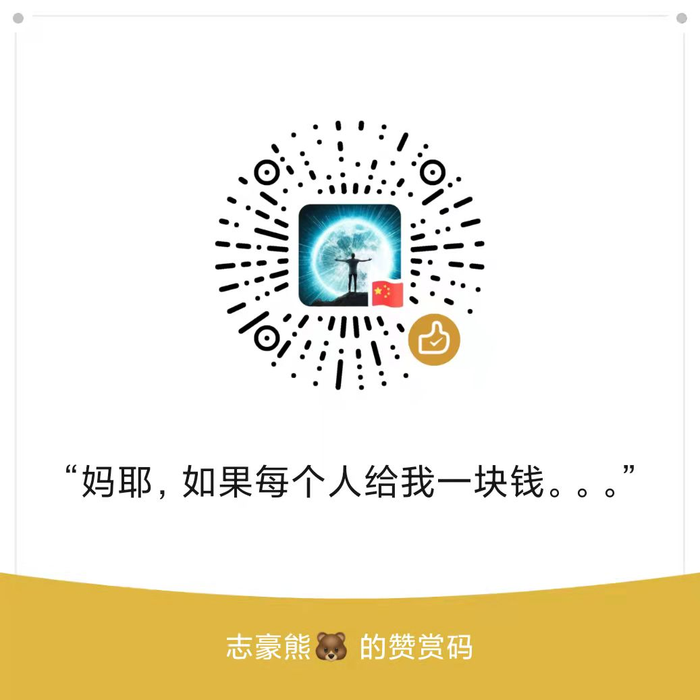

# 每月流量紧张，大家尽量使用视频地址去下载

微信小程序虽不会记录和保存视频资源，但是下载视频会消耗流量，每月使用的配置有限，如果有能力那就赞助呗，上架CDN资源，更丝滑！

如有技术咨询问题，就进微信群了解~

# 时隔三年终于全新改版了 - 短视频去水印解析小程序工具集

从微信小程序刚发布时，就创立了工具小程序仓库，主要调研技术，比较随意

最近在看自媒体，当然又更新了一个全新 2.0 版本工具，永久免费~

这个分支是全新版本，master 分支还保留之前版本，当然之前版本是 3 年前~

该项目是小程序云开发版本，是最新全版本，创立项目之初，参考其他项目发现都是阉割版本，用的难受，所以自己做了一版！

## 小程序体验

或者微信小程序搜索 “便捷去水印工具集”

## 在线体验地址

- [短视频/图集在线去水印解析 https://video.wuhou.fun/](https://video.wuhou.fun/)

## 介绍

一款短视频去水印，去水印小工具，短视频无水印，短视频去水印，免费去水印，提取无水印视频，支持抖音，火山，西瓜视频视频等主流短视频平台。

## 部署方式

1. 申请小程序账号
2. 开通小程序云开发
3. 在 `project.config.json` 文件中修改 `appid` 和 `projectname`
4. 将云函数部署到云端（备注：remove_watermark_v3 是最新版本，可以只部署当前版本）
5. 将使用教程里面的图片上传到云存储并替换链接
6. 将分享 Logo 图片上传到云存储并替换链接
7. 主要方法在云函数 `remove_watermark_v3`

## 备注

1. 项目使用了小程序[云开发](https://developers.weixin.qq.com/miniprogram/dev/wxcloud/basis/getting-started.html)，不用购买服务器即可部署运行；
2. 组件库使用了 [vant](https://vant-contrib.gitee.io/vant-weapp/#/home)。

## 打赏

如果项目对你有帮助，或者你需要帮助，需要帮忙敲代码，需要 ps 切图，需要搞定产品，需要搞定后端，请打赏，我来办事！当然有任何技术问题请[留言](https://wuhou.fun/msg)

## 参考文档及项目

- [云开发文档](https://developers.weixin.qq.com/miniprogram/dev/wxcloud/basis/getting-started.html)

- [参考项目](https://gitee.com/mini-app-private/qsy)
